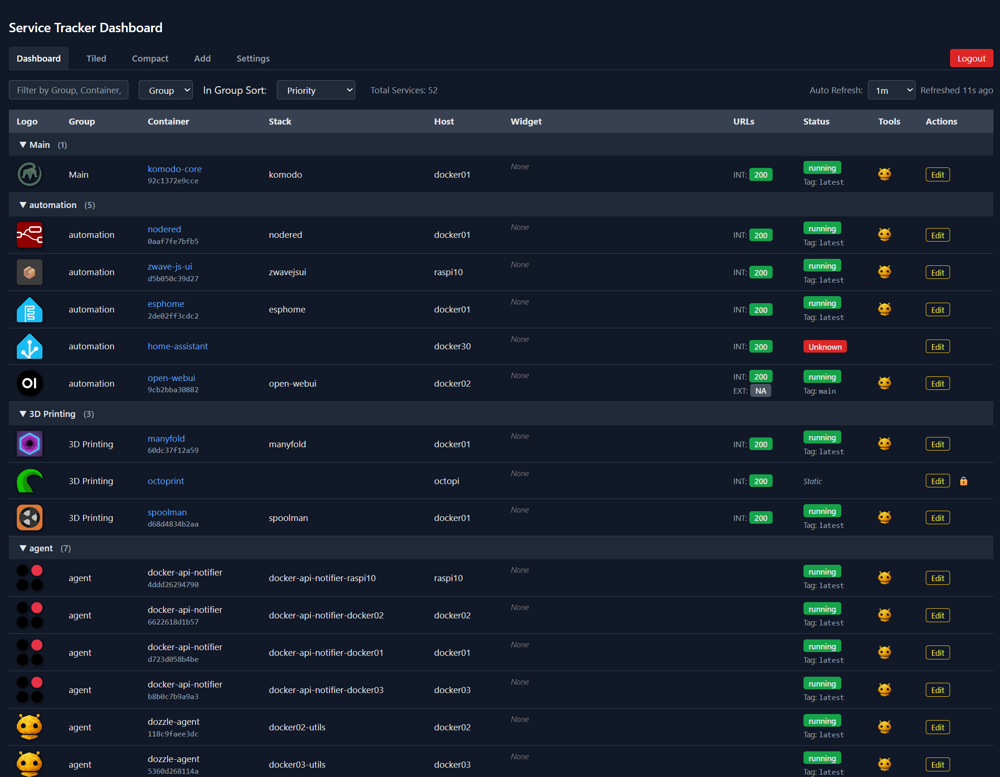
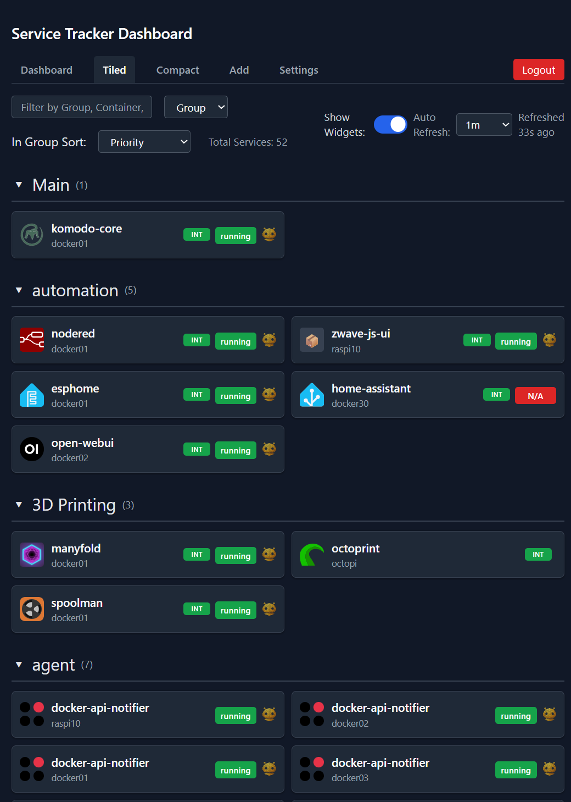
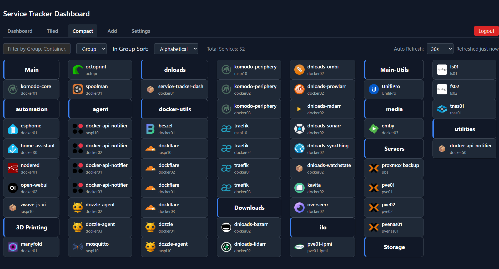
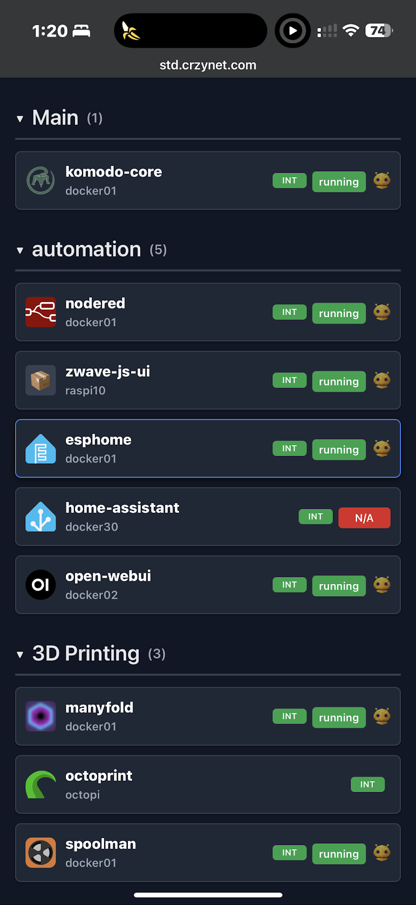
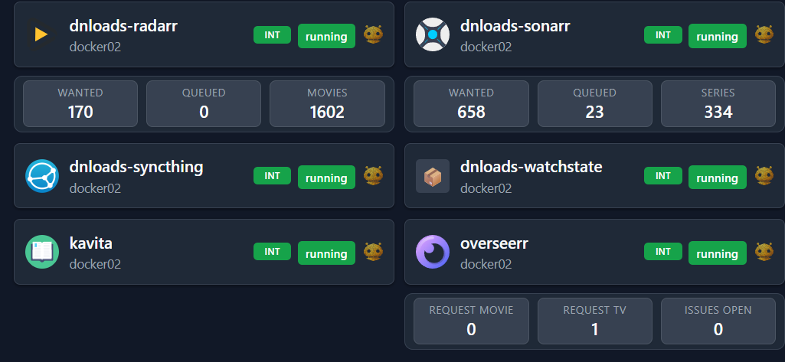
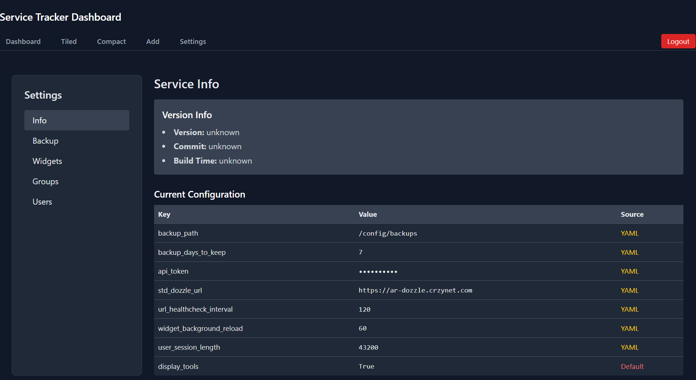

# 🧭 Service Tracker Dashboard
# Breaking Change in v0.4.9
you must backup (or not) and delete your db on start.  then restore. 

A simple Flask web app that helps you track, organize, and monitor Docker containers across your lab or home setup. You can view service details, run health checks, group entries, and manage everything through a clean web UI or via API. Built for small environments, but flexible enough to grow with your stack.  

This service relies on [docker-api-notifier](https://github.com/crzykidd/docker-api-notifier)  This uses labels to send info from your docker hosts to this dashboard.   Most all settings for docker containers can be set via labels, but you can update something in the dashboard, however docker container labels take priority.  The notifier sends updates to give latest docker container info to the dash on it's update interval

I wrote this as 90% of my stuff runs in docker, but you can manually add other hosts if you want to use it for your entire dashboard. 

---

## 🚀 What It Does

- Multiple Dash views from full to tiled to compact
- tiled dash looks great on mobile device
- Internal + external health checks every x seconds
- Auto-downloads container icons from [Homarr Labs](https://github.com/homarr-labs/dashboard-icons)
- API support for pushing container metadata
- Simple SQLite database backend
- Daily YAML backups with retention policy
- Manual add/edit/delete interface
- Dozzle log integration (optional)
- Clean UI with dark mode support
- Designed to run cleanly in Docker
- Now supports local user management
- Supports sort priority in groups
- Supports grouping items together and sorting by group.


---

## Screenshots

| Main Dashboard | Tiled View | Compact View |
|---|---|---|
| [](std_main_dashboard.png) | [](std_tile_dashboard.png) | [](std_compact_dashboard.png) |

| Mobile View | Widgets | Settings |
|---|---|---|
| [](std_mobile.png) | [](std_widgets.png) | [](std_settings.png) |

## 🔧 Config Overview

You can configure the app using environment variables or a `settings.yml` file inside `/config`. ENV vars take priority over the file. If `settings.yml` doesn’t exist, it’ll be created from a default template.

### Supported Settings

| Setting Name            | Type   | ENV Variable Name         | What it does                                      |
|-------------------------|--------|----------------------------|---------------------------------------------------|
| `api_token`             | string | `API_TOKEN`                | Required auth token for the API                   |
| `std_dozzle_url`        | string | `STD_DOZZLE_URL`           | Link to your Dozzle instance (optional)           |
| `backup_path`           | string | `BACKUP_PATH`              | Directory to store YAML backups                   |
| `backup_days_to_keep`   | int    | `BACKUP_DAYS_TO_KEEP`      | How long to keep daily backups (in days)          |
| `url_healthcheck_interval` | int  | `URL_HEALTHCHECK_INTERVAL` | How long between health checks on URLs           |
| `user_session_length`  | int  | `USER_SESSION_LENGTH`  | what is the default user session length                  |

### Example `settings.yml`

```yaml
api_token: supersecrettoken
std_dozzle_url: http://dozzle.local
backup_path: /config/backups
backup_days_to_keep: 7
user_session_length: 120 # in minutes
```

---

## 🐳 Docker Compose Setup

```yaml
services:
  service-tracker-dashboard:
    image: yourdockerhubuser/service-tracker-dashboard:latest
    container_name: service-tracker-dashboard
    ports:
      - 8815:8815
    environment:
      - API_TOKEN=supersecrettoken
      - STD_DOZZLE_URL=http://dozzle.local
      - FLASK_DEBUG=0
      - FLASK_SECRET_KEY=changeme-in-prod
    volumes:
      - /var/run/docker.sock:/var/run/docker.sock:ro
      - /etc/hostname:/etc/host_hostname:ro
      - ./config:/config
    restart: unless-stopped
```

Make sure to update the image name with your Docker Hub username or registry if needed.

---

## 📥 API: Registering Services

Send a `POST` request to `/api/register` with your service data. This endpoint requires a bearer token (defined by `API_TOKEN`).

**Headers:**
```http
Authorization: Bearer your_token
Content-Type: application/json
```

**Sample JSON:**
```json
{
  "host": "docker01",
  "container_name": "nginx",
  "internalurl": "http://nginx:80",
  "externalurl": "https://my.domain.com",
  "stack_name": "frontend",
  "docker_status": "running",
  "image_name": "ghcr.io/user/nginx:latest",
  "group_name": "web",
  "internal_health_check_enabled": true,
  "external_health_check_enabled": true,
  "image_icon": "nginx.svg"
}
```

---

## 🏷️ Docker Labels (Optional)

If you're using an external tool to send events (like `docker-api-notifier`), you can use labels like this:

```yaml
labels:
  dockernotifier.notifiers: service-tracker-dashboard"
  dockernotifier.std.internalurl: http://nginx:80"
  dockernotifier.std.externalurl: https://nginx.domain.com"
  dockernotifier.std.group: web
  dockernotifier.std.internal.health: true
  dockernotifier.std.sort.priority: 1   
```

---

## 📂 Files and Paths

| Path                     | Purpose                          |
|--------------------------|----------------------------------|
| `/config/services.db`    | SQLite database                  |
| `/config/std.log`        | Main app logs (with rotation)    |
| `/config/images/`        | Cached icons                     |
| `/config/backups/`       | YAML backups (manual + nightly)  |
| `/config/settings.yml`   | Optional config file             |

---

## 🧪 Health Checks

- Checks run every 60 seconds in the background
- Internal and external URLs are pinged if enabled
- Status code and timestamp are saved for both
- Failed checks don’t crash the app — they’re logged and move on
- UI shows color-coded status (green/yellow/red)

---

## 🌐 App Routes

| Route             | What it does                        |
|-------------------|-------------------------------------|
| `/`               | Main dashboard (table view)         |
| `/tiled_dash`     | Grid-style dashboard                |
| `/add`            | Manually add a new entry            |
| `/edit/<id>`      | Edit or delete an existing entry    |
| `/settings`       | Backup/restore via web interface    |
| `/dbdump`         | Raw dump of all DB entries          |
| `/images/<file>`  | Serves icon files from image cache  |
| `/api/register`   | Programmatic entry/update endpoint  |

---

## 🧠 How It Behaves

- If an entry is marked as "static", the API won't overwrite it
- Icon fetch falls back to using the container name (lowercased and hyphenated)
- Nightly backups are saved at 12:05 AM
- Old backups are auto-deleted based on your retention setting
- Version metadata (from `/app/version.txt`) shows up in `/settings`

---

## 📍 Getting Started

Once running, hit the web UI at:  
👉 [http://localhost:8815](http://localhost:8815)

- View the dashboard  
- Add/edit entries  
- Restore from backup  
- Register services via API

---
