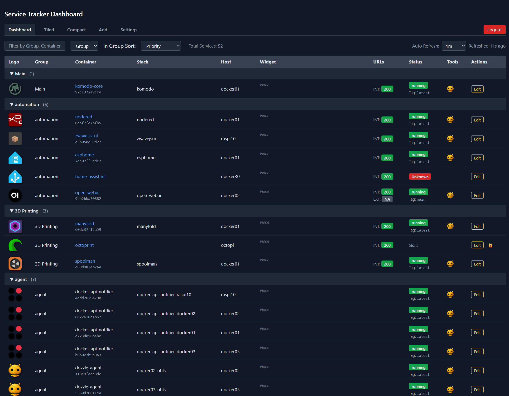
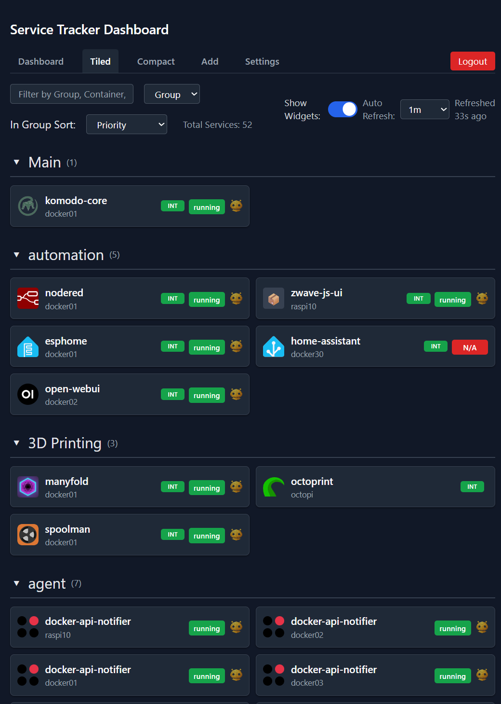
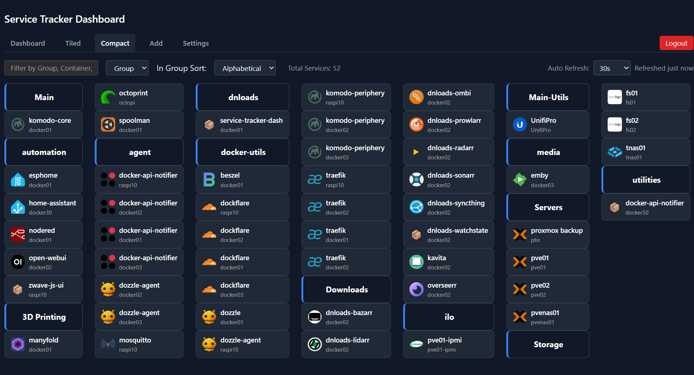
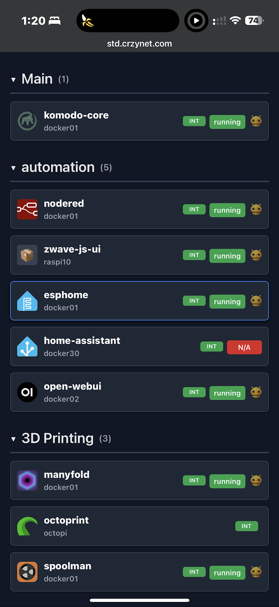
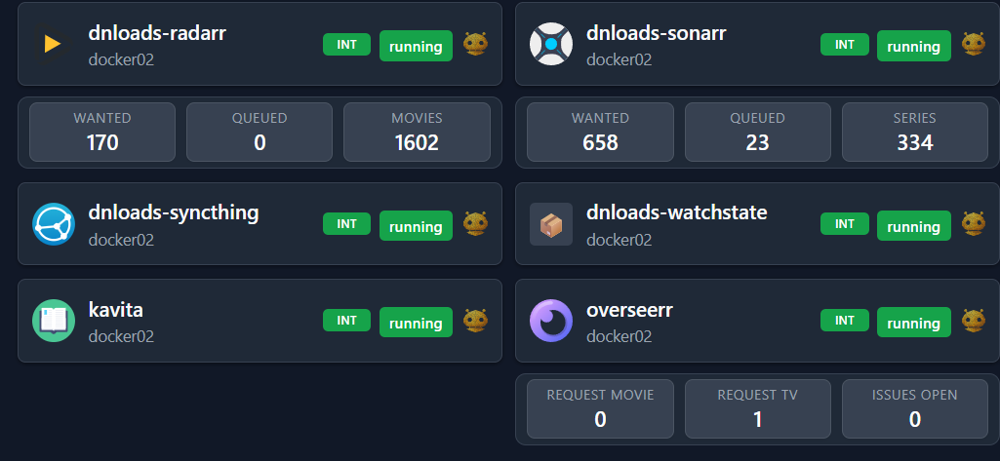
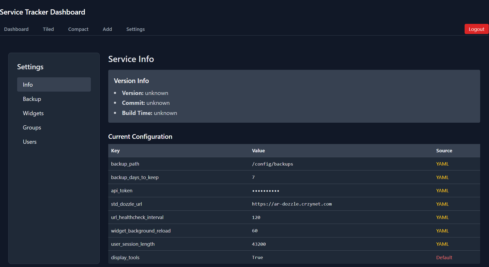

# 🧭 Service Tracker Dashboard (STD)


A homelab-scale Flask dashboard that tracks Docker services across multiple
hosts, runs background URL health checks, and renders a small set of
dashboard views (full, tiled, compact). Service entries are populated and
kept current by a sidecar process — typically
[docker-api-notifier](https://github.com/crzykidd/docker-api-notifier) —
posting to STD's register endpoint, but you can also add entries by hand
through the web UI or directly via API.

> **v0.5.0 introduces a new `/api/v1/register` endpoint with canonical
> key names.** The old `/api/register` endpoint continues to work with a
> compat shim that maps legacy keys (`docker_host`, `group_name`,
> `internal.health`, ...) to canonical names and emits a deprecation
> warning. **`/api/register` and the legacy keys will be removed in v0.6.0.**
> If you're running `docker-api-notifier`, upgrade to v0.3.0 or later
> before STD v0.6.0 ships.

---

## Table of Contents

1. [What It Does](#what-it-does)
2. [Screenshots](#screenshots)
3. [Configuration](#configuration)
4. [Docker Compose Setup](#docker-compose-setup)
5. [Database Migrations](#database-migrations)
6. [API: Registering Services](#api-registering-services)
7. [Container Labels (via docker-api-notifier)](#container-labels-via-docker-api-notifier)
8. [Files and Paths](#files-and-paths)
9. [Health Checks](#health-checks)
10. [Routes](#routes)
11. [Widgets](#widgets)
12. [Behavior Notes](#behavior-notes)
13. [Versioning & Releases](#versioning--releases)

---

## What It Does

- Three dashboard views (table, tiled, compact). Tiled view is mobile-friendly.
- Internal + external URL health checks on a configurable interval.
- Auto-downloads container icons from
  [Homarr Labs Dashboard Icons](https://github.com/homarr-labs/dashboard-icons).
- Register endpoint for pushing container metadata from external tools.
- SQLite backing store, file-based, no external DB server.
- Daily YAML backups with retention.
- Manual add / edit / delete through the web UI.
- Optional Dozzle log link integration.
- Local user accounts with session-based auth.
- Per-entry sort priority within groups; grouping and group sort.
- Pluggable widget system (Sonarr, Radarr, Bazarr, Overseerr, Prowlarr,
  Syncthing today; more under `widgets/`).

---

## Screenshots

| Main Dashboard | Tiled View | Compact View |
|---|---|---|
| [](docs/screenshots/std_main_dashboard.png) | [](docs/screenshots/std_tile_dashboard.png) | [](docs/screenshots/std_compact_dashboard.png) |

| Mobile View | Widgets | Settings |
|---|---|---|
| [](docs/screenshots/std_mobile.png) | [](docs/screenshots/std_widgets.png) | [](docs/screenshots/std_settings.png) |

---

## Configuration

STD reads config from environment variables and an optional
`/config/settings.yml`. Environment variables take priority. If
`settings.yml` is missing, defaults apply and a `settings.example.yml`
is dropped into `/config` for reference.

Default login: `admin` / `changeme123`. Change it on first run.

### Settings reference

| Setting                    | Type   | ENV                          | Default            | What it does |
|----------------------------|--------|------------------------------|--------------------|--------------|
| `api_token`                | string | `API_TOKEN`                  | —                  | Bearer token required by `/api/register` and `/api/v1/register`. |
| `std_dozzle_url`           | string | `STD_DOZZLE_URL`             | —                  | Optional link to a Dozzle instance; enables a Tools section in the UI. |
| `backup_path`              | string | `BACKUP_PATH`                | `/config/backups`  | Where YAML backups are written. |
| `backup_days_to_keep`      | int    | `BACKUP_DAYS_TO_KEEP`        | `7`                | Backup retention. |
| `url_healthcheck_interval` | int    | `URL_HEALTHCHECK_INTERVAL`   | `300`              | Seconds between health check passes. |
| `widget_background_reload` | int    | `WIDGET_BACKGROUND_RELOAD`   | `900`              | Seconds between widget data refreshes. |
| `widget_value_retention_days` | int | `WIDGET_VALUE_RETENTION_DAYS` | `30`            | Days of `widget_value` history to retain. A daily 00:15 background job prunes older rows. |
| `register_field_ownership` | string | `REGISTER_FIELD_OWNERSHIP`   | `user_wins`        | How register calls handle conflicts with UI edits on `group_name` and `sort_priority`. `user_wins` (default) preserves non-NULL UI values on update; `notifier_wins` always overwrites. Invalid values fall back to `user_wins` with a startup warning. |
| `user_session_length`      | int    | `USER_SESSION_LENGTH`        | `120`              | User session length in minutes. |
| `flask_secret_key`         | string | `FLASK_SECRET_KEY`           | —                  | Required for production. Used to sign session cookies. |

### Example `settings.yml`

```yaml
api_token: supersecrettoken
std_dozzle_url: http://dozzle.local
backup_path: /config/backups
backup_days_to_keep: 7
url_healthcheck_interval: 300
widget_background_reload: 900
widget_value_retention_days: 30
register_field_ownership: user_wins
user_session_length: 120
```

---

## Docker Compose Setup

```yaml
services:
  service-tracker-dashboard:
    image: crzykidd/service-tracker-dashboard:latest
    container_name: service-tracker-dashboard
    ports:
      - 8815:8815
    environment:
      - API_TOKEN=supersecrettoken
      - STD_DOZZLE_URL=http://dozzle.local
      - FLASK_DEBUG=0
      - FLASK_SECRET_KEY=changeme-in-prod
    volumes:
      - ./config:/config
    restart: unless-stopped
```

---

## Database Migrations

Schema changes are tracked with [Alembic](https://alembic.sqlalchemy.org/).
Migrations live in `alembic/versions/` and `alembic upgrade head` runs
automatically on container start (see `entrypoint.sh`).

To create a new migration after changing models, exec into a running
container:

```bash
docker compose exec <service-name> \
  alembic revision --autogenerate -m "describe the change"
```

The new revision file lands under `alembic/versions/`. Review it before
committing — autogenerate doesn't catch every kind of change
(constraint renames, default-only changes, SQLite-specific quirks).

To check whether models and the live database have diverged without
writing a migration:

```bash
docker compose exec <service-name> alembic check
```

---

## API: Registering Services

> **v0.5.0+** — prefer `/api/v1/register` with canonical keys. The
> `/api/register` endpoint still works but emits a deprecation warning
> and will be removed in v0.6.0.

### Endpoint

```
POST /api/v1/register
Authorization: Bearer <API_TOKEN>
Content-Type: application/json
```

### Canonical payload (v0.5.0+)

```json
{
  "host": "docker01",
  "container_name": "nginx",
  "container_id": "abc123...",
  "image_name": "ghcr.io/user/nginx:latest",
  "image_icon": "nginx.svg",
  "docker_status": "running",
  "stack_name": "frontend",
  "started_at": "2026-05-10T12:34:56Z",
  "timestamp": "2026-05-10T12:35:00Z",
  "internalurl": "http://nginx:80",
  "externalurl": "https://my.domain.com",
  "internal_health_check_enabled": true,
  "external_health_check_enabled": true,
  "group_name": "web",
  "sort_priority": 1
}
```

### Required fields

- `host` — Docker host name. Composite key with `container_name`.
- `container_name` — name of the container.

Everything else is optional. STD applies sensible defaults for any
field that's missing.

`/api/v1/register` is **strict** — unknown keys are rejected with a
400 and the list of offending keys in the response body. Migrate
producers off legacy keys before pointing them at the v1 endpoint.

### Field ownership: user_wins vs notifier_wins

`group_name` and `sort_priority` can be edited in the web UI. When a
notifier register arrives for a row whose UI value differs, the
`register_field_ownership` setting decides who wins:

- **`user_wins`** (default) — UI edits stick. The notifier may
  populate these fields on a new row or one where they're still
  NULL, but it won't overwrite a value the operator has set.
- **`notifier_wins`** — every register call overwrites everything,
  including UI edits. Choose this if your container labels are the
  source of truth.

Regardless of mode, STD records what the notifier sent in
`notifier_reported_group_name` and `notifier_reported_sort_priority`
columns. These columns aren't surfaced in the UI yet — they support
a planned overridden-labels export.

### Legacy support (deprecated, removed in v0.6.0)

The `/api/register` endpoint accepts canonical keys plus these
legacy variants:

| Legacy key        | Canonical key                     |
|-------------------|-----------------------------------|
| `docker_host`     | `host`                            |
| `group`           | `group_name`                      |
| `internal_health` | `internal_health_check_enabled`   |
| `internal.health` | `internal_health_check_enabled`   |
| `external_health` | `external_health_check_enabled`   |
| `external.health` | `external_health_check_enabled`   |
| `icon`            | `image_icon`                      |
| `sort.priority`   | `sort_priority`                   |

(`internalurl` and `externalurl` are canonical — they have always
been single-word in STD. No remap.)

The compat shim normalizes legacy keys to canonical and emits a
`Deprecation: true` response header plus
`Link: </api/v1/register>; rel="successor-version"`. There is no
`Sunset` header in v0.5.0 — it will be added in v0.6.0 once the
removal date is firm. The server also logs a deprecation WARNING
once per client IP per hour, so the migration conversation gets
driven without flooding the log.

Unknown keys in legacy payloads are silently dropped (matches
v0.4.x behavior). In `FLASK_DEBUG=1` they're logged.

---

## Container Labels (via docker-api-notifier)

If you run [docker-api-notifier](https://github.com/crzykidd/docker-api-notifier)
on each Docker host, you can drive STD entirely from labels in your
compose files:

```yaml
labels:
  dockernotifier.notifiers: service-tracker-dashboard
  dockernotifier.std.internalurl: http://nginx:80
  dockernotifier.std.externalurl: https://nginx.domain.com
  dockernotifier.std.group: web
  dockernotifier.std.internal.health: "true"
  dockernotifier.std.sort.priority: "1"
```

Notifier v0.3.0+ emits canonical keys to `/api/v1/register` automatically.

---

## Files and Paths

| Path                     | Purpose                          |
|--------------------------|----------------------------------|
| `/config/services.db`    | SQLite database (WAL mode).      |
| `/config/std.log`        | Main app log (rotated).          |
| `/config/images/`        | Cached service icons.            |
| `/config/backups/`       | YAML backups (manual + nightly). |
| `/config/settings.yml`   | Optional config file.            |

---

## Health Checks

- Run on the `url_healthcheck_interval` (default 300 seconds).
- Internal and external URLs are pinged if their respective
  `*_health_check_enabled` flags are set.
- Status code, response time, and timestamp are recorded per check.
- A failed check logs and moves on; it does not crash the loop.
- UI shows color-coded status (green / yellow / red) with last-checked time.

---

## Routes

| Route                | Purpose                                  |
|----------------------|------------------------------------------|
| `/`                  | Main dashboard (table view).             |
| `/tiled_dash`        | Grid-style dashboard.                    |
| `/compact_dash`      | High-density compact view.               |
| `/add`               | Manually add a new entry.                |
| `/edit/<id>`         | Edit or delete an existing entry.        |
| `/settings`          | Settings + backup/restore UI.            |
| `/dbdump`            | Raw dump of all DB entries (admin).      |
| `/images/<file>`     | Serve cached icon files.                 |
| `/api/v1/register`   | Register/update entry (v0.5.0+).         |
| `/api/register`      | Deprecated alias; removed in v0.6.0.     |
| `/login` `/logout`   | Local user auth.                         |

---

## Widgets

Widgets live under `widgets/<name>/` and are loaded dynamically. Each
widget directory contains:

- `__init__.py`
- `fetch_data.py` — pulls data from the upstream service.
- `settings.json` — declarative config schema.
- `README.md` — widget docs.

Built-in widgets: Sonarr, Radarr, Bazarr, Overseerr, Prowlarr, Syncthing.

Widget data is sampled on the `widget_background_reload` interval and
cached in the `widget_value` table. Retention: rolling 30 days
(introduced in v0.5.0).

---

## Behavior Notes

- Entries marked `static` are not overwritten by API register calls.
- Icon fetch falls back to a lowercased, hyphenated container name when
  no explicit icon is provided.
- Nightly backups run shortly after midnight; old backups are pruned
  per `backup_days_to_keep`.
- Version metadata is shown in `/settings`.

---

## Versioning & Releases

- `:latest` follows `main` — CI-verified pre-release.
- `:dev` follows `dev` — work in progress.
- `:sha-<short>` published for every push.
- Semver-tagged images (`:0.5.0`, `:0`) published from GitHub Releases.

Branch protection: PRs into `main` must pass the build check; force-push
and branch deletion are blocked. Work happens on `dev`, opens a PR to
`main`, and merges only when CI is green. Release tags are cut from the
GitHub Releases UI on `main`.

---

## License

MIT — see [LICENSE](LICENSE).
